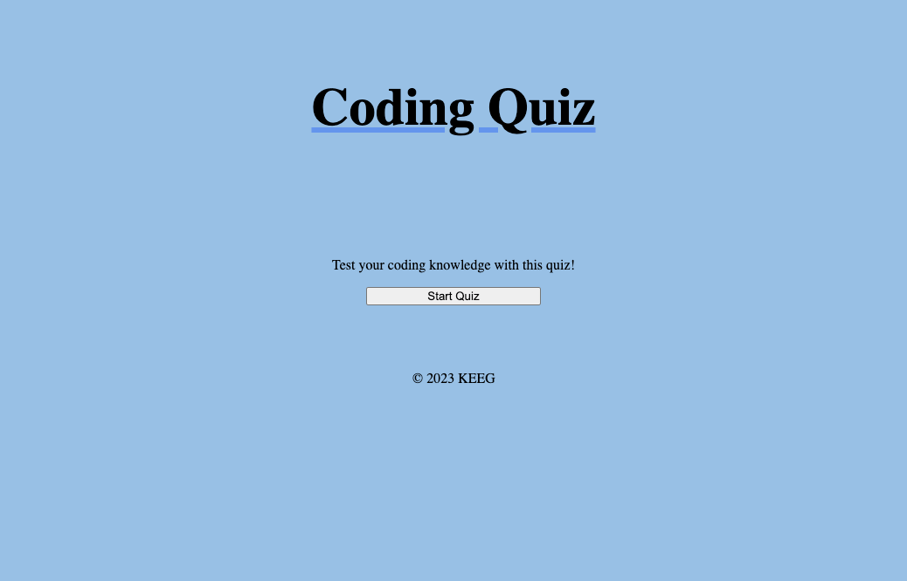

# Timed-Multiple-Choice-Coding-Quiz

## Description

The following project is a timed quiz on JavaScript fundamentals that stores high scores. As a user you are taken to a webpage titled Coding Quiz. You will be presented with a start quiz button, after clicking the start quiz button you will be presented with your first multiple choice question. If you answer the question, then you will be presented with the next quiz question. If you answer the question incorrectly, then 10 seconds of time is subtracted from the timer. When all questions have been answered or the timer reaches zero, then the game is over. I then am prompted to enter and save my initials and score.

## Author 

Keegan Omel

## Contributors

Austin Grech,

Bruno Rosarini

## Live Link

## Githhub Link

https://github.com/Keegan-Omel/Timed-Multiple-Choice-Coding-Quiz
